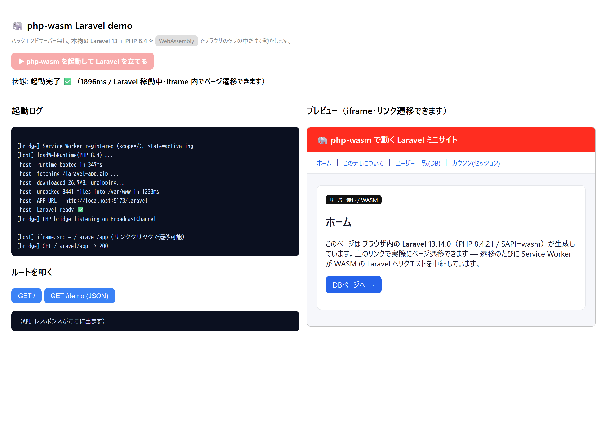
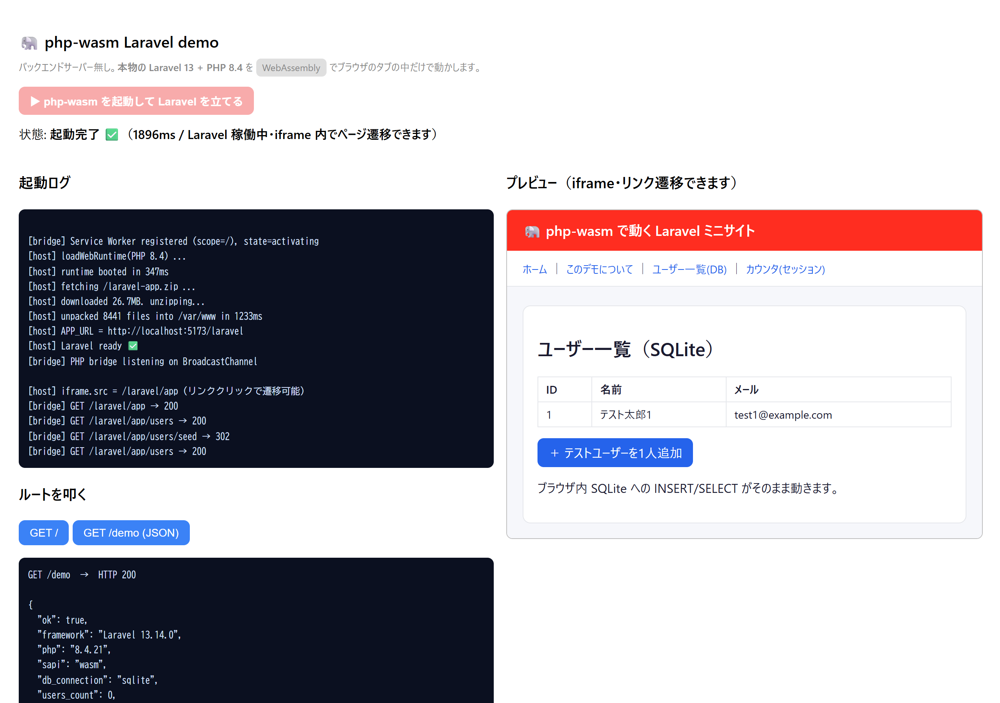
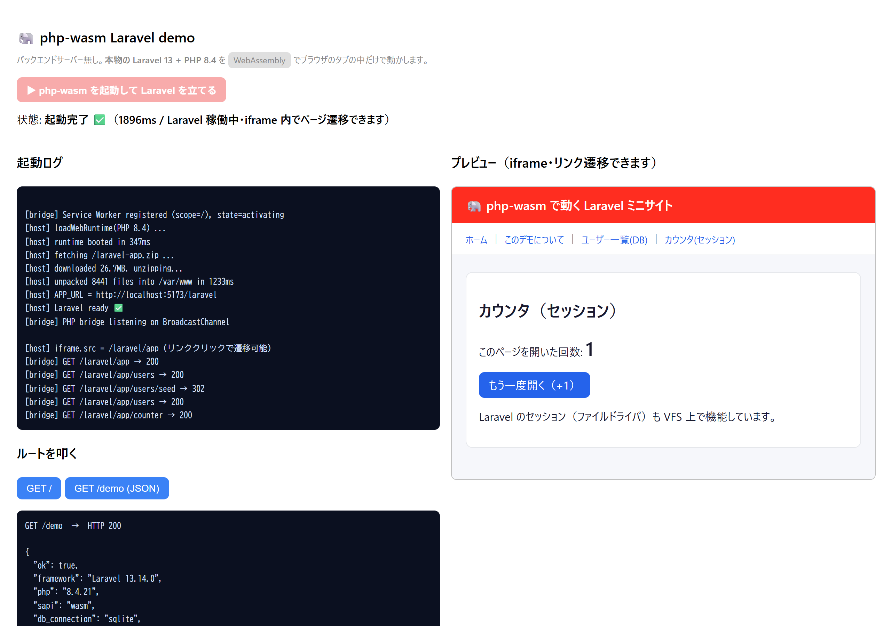
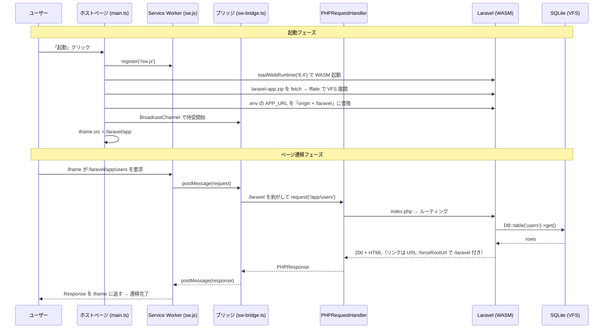

# php-wasm-laravel-demo


ブラウザのタブの中だけで **本物の Laravel 13 + PHP 8.4** を起動するデモです。
バックエンドサーバーは一切立てず、[`@php-wasm/web`](https://www.npmjs.com/package/@php-wasm/web)（WordPress Playground 由来の WebAssembly 製 PHP ランタイム）が PHP の実処理をすべてブラウザ内で動かしています。

> 隣の `nodepod-express-demo`（ブラウザ内 Node.js + Express）の **PHP / Laravel 版**です。
> 「環境（NodePod → php-wasm）」を差し替えただけで、同じ『サーバー不要』構図が成り立つことを実証します。

## 検証結果（このリポジトリで実際に確認済み）

| 検証 | 方法 | 結果 |
|------|------|------|
| ① PHP が WASM で動くか | `npm run verify:php`（@php-wasm/node・ヘッドレス） | ✅ PHP 8.4.20 / SAPI=wasm / 44拡張（pdo_sqlite・mbstring・openssl・tokenizer 等） |
| ② Laravel が WASM で動くか | `npm run verify:laravel`（実物の laravel-app をマウント） | ✅ `GET /`=200(Blade描画) / `GET /demo`=200(JSON) / **SQLite クエリ成功** / artisan CLI も動作 |
| ③ 実ブラウザで動くか | `npm run verify:browser`（Chrome 自動操作） | ✅ 起動 約1.1秒 / `crossOriginIsolated=true` / `/demo`=200 / iframe に描画 |
| ④ iframe 内でページ遷移できるか | `npm run verify:nav`（Chrome 自動操作） | ✅ リンク遷移 / **DB へ INSERT→redirect 反映** / **セッション +1 保持**（すべて SW 経由で WASM が応答） |

検証③の実際の出力（`/demo`）:

```json
{
  "ok": true,
  "framework": "Laravel 13.14.0",
  "php": "8.4.21",
  "sapi": "wasm",
  "db_connection": "sqlite",
  "users_count": 0,
  "mb_check": "ブラウザ内LARAVEL",
  "time": "2026-06-05T07:03:47+00:00"
}
```

## できること

- ブラウザ内で **本物の Laravel 13（PHP 8.4 / WASM）** が起動する
- **iframe 内でリンクをクリックしてページ遷移できる**（Service Worker が中継）。普通のサイトのように複数ページを行き来できる
- **SQLite を使った DB クエリ／INSERT** がブラウザ内だけで完結（ユーザー追加→一覧反映）
- **セッション**（ファイルドライバ）も VFS 上で機能（カウンタが保持される）
- `mb_*` など PHP 拡張・日本語処理もそのまま動く
- `artisan` CLI も WASM 内で実行できる

起動後、iframe には Laravel 製のミニサイト（`/app`）が表示され、ナビの
「ホーム / About / ユーザー一覧(DB) / カウンタ(セッション)」を実際に遷移できます。

## 成果物（画面）

| 画面 | 内容 |
|------|------|
| 起動完了 | ブラウザ内で PHP 8.4 が起動し、iframe に Laravel ミニサイト（`/app`）を表示 |
| `/app/users` | ナビから遷移 → ブラウザ内 SQLite の `users` を一覧表示 |
| ユーザー追加 | 「＋ テストユーザーを1人追加」→ **INSERT → redirect → 一覧に反映** |
| `/app/counter` | 開くたびに **セッションのカウンタが +1**（ファイルセッションが VFS 上で機能） |
| `GET /demo` | `Laravel 13.14.0 / php 8.4 / sapi=wasm / db=sqlite` を JSON で返す（HTTP 200） |

### スクリーンショット

**起動完了** — ブラウザ内で PHP 8.4 が起動し、iframe に Laravel ミニサイトを表示（左は起動ログ）



**ユーザー一覧（SQLite）** — ナビから遷移し、追加した「テスト太郎1」を表示。ログに
`/laravel/app/users → 200` と `/laravel/app/users/seed → 302`（INSERT 後のリダイレクト）が見える



**カウンタ（セッション）** — 開くたびにセッションのカウンタが増える



> スクリーンショットは `npm run shots`（= `node scripts/screenshots.mjs`、要 puppeteer-core）で再生成できます。

## 動作要件

| 項目 | 要件 |
|------|------|
| Node.js | v20 以上（ホストアプリのビルド・検証用） |
| PHP / Composer | ローカルに PHP 8.2+ と Composer（**laravel-app の生成にのみ必要**。ブラウザ実行には不要） |
| ブラウザ | Chrome / Chromium 系推奨（WASM + COOP/COEP を使用） |
| ネットワーク | 初回のみ（php-wasm ランタイムと laravel-app.zip を取得するため） |

## クイックスタート

```bash
# 0) ローカルに Laravel 本体を生成（初回のみ。PHP+Composer が必要）
composer create-project laravel/laravel laravel-app

# 1) 依存インストール（初回のみ）
npm install

# 2) ブラウザ配信用に Laravel を zip 化（laravel-app → public/laravel-app.zip）
node scripts/bundle-laravel.mjs

# 3) 開発サーバー起動 → http://localhost:5173 を開く
npm run dev
```

ブラウザで開いたら **「▶ php-wasm を起動して Laravel を立てる」** をクリック。
起動後は **iframe 内のナビをクリックしてページ遷移**できます（ユーザー追加・カウンタも動く）。
左下の `GET /demo` ボタンでは JSON レスポンスも確認できます。

### 検証コマンド

```bash
npm run verify:php        # ① PHP 単体が WASM で動くか（ヘッドレス）
npm run verify:laravel    # ② 実物の Laravel が WASM で応答するか（ヘッドレス）
npm run verify:browser    # ③ 実ブラウザ(Chrome)で端から端まで（要 puppeteer-core）
npm run verify:nav        # ④ iframe 内のページ遷移・DB更新・セッション（要 puppeteer-core）
npm run bundle            # laravel-app を再 zip 化（routes 等を変更したら実行）
```

> ①② はブラウザ不要（Node 内の WASM で実行）。③④ はローカルの Chrome を自動操作します
> （`C:/Program Files/Google/Chrome/Application/chrome.exe` を参照。パスが違う場合はスクリプト先頭を調整）。

## アーキテクチャ

詳しい図解は [docs/architecture.md](docs/architecture.md)。`nodepod-express-demo` との対応で見るのが分かりやすいです。

| nodepod-express-demo | このデモ（php-wasm-laravel-demo） |
|---|---|
| NodePod（WASM 製 Node.js 環境） | **@php-wasm/web**（WASM 製 PHP 環境） |
| Express（npm の部品） | **Laravel**（composer の部品） |
| `server.js` | `laravel-app/`（実物の Laravel） |
| Express が listen → iframe | PHPRequestHandler.request() → iframe / result |
| **Service Worker で iframe を中継** | **同じ（public/sw.js）** ← ページ遷移を成立させる主役 |

### iframe 内でページ遷移できる仕組み（Service Worker）

srcdoc で1ページ貼るだけだとリンク遷移できない。そこで nodepod デモと同じく
**Service Worker で iframe のリクエストを横取り**し、WASM の Laravel へ中継している。

```
iframe が /laravel/app/users へ遷移（リンククリック）
   │ fetch
   ▼
public/sw.js が横取り（scope=/, /laravel/* のみ対象）
   │ BroadcastChannel('php-wasm-bridge')
   ▼
src/sw-bridge.ts（メインページ）が受信
   │ /laravel を剥がして '/app/users' に
   ▼
PHPRequestHandler.request() → WASM の Laravel が応答（DB/セッション込み）
   │ 応答を BroadcastChannel で返す
   ▼
sw.js が Response を組み立てて iframe に返す → 遷移完了
```

- **URL スコープ `/laravel`**：SW が中継対象を判定するための接頭辞。
- **ルーティング**：ブリッジが `/laravel` を剥がして渡すので Laravel は `/app/users` として正しくルートを解決。
- **リンク生成**：`.env` の `APP_URL` を起動時に「実オリジン + /laravel」へ書き換え、
  `AppServiceProvider` で `URL::forceRootUrl()` する。これで Laravel が出すリンク／リダイレクトに
  自動で `/laravel` が付き、SW スコープ内に収まる。
- **直列化**：PHP は単一インスタンス（シングルスレッド）なので、ブリッジ側でリクエストを直列処理。

```
あなたの PC
 └─ Vite 開発サーバー (localhost:5173)   ← 静的ファイルを配るだけ（本番は静的ホスティング可）
        │ index.html / main.ts / laravel-app.zip を配信
        ▼
   ブラウザのタブ
     ┌──────────────────────────────────────────────┐
     │  ホストページ (main.ts)                         │
     │   ① loadWebRuntime → WASM の PHP 8.4 を起動      │
     │   ② laravel-app.zip を fetch → fflate で VFS展開  │
     │   ③ PHPRequestHandler で request('/') を処理      │
     │  ┌─ @php-wasm/web（WASM の PHP 環境）─────────┐  │
     │  │   /var/www/public/index.php → Laravel 13   │  │  ← 「サーバー不要」の主役
     │  │   DB は WASM 版 SQLite（/var/www/database） │  │
     │  └────────────────────────────────────────────┘  │
     └──────────────────────────────────────────────────┘
```

## 動作シーケンス



## ディレクトリ構成

```
php-wasm-laravel-demo/
├─ index.html              # ホストアプリ（起動ボタン・ログ・iframe・APIボタン）
├─ vite.config.ts          # COOP/COEP 付与・optimizeDeps(ini を include)
├─ src/
│  ├─ main.ts              # 起動フロー（SW登録 → boot → bridge → iframe）
│  ├─ php-host.ts          # php-wasm 起動・zip展開・.env書換・PHPRequestHandler 構築
│  └─ sw-bridge.ts         # SW↔PHP ブリッジ（/laravel 剥がし・直列化）
├─ public/
│  ├─ sw.js                # Service Worker（/laravel/* を横取りして中継）
│  └─ laravel-app.zip      # 配信用に固めた Laravel（bundle で生成・gitignore）
├─ scripts/
│  ├─ verify-php.mjs       # 検証① PHP 単体（@php-wasm/node）
│  ├─ verify-laravel.mjs   # 検証② Laravel をマウントして request()
│  ├─ verify-browser.mjs   # 検証③ 実ブラウザ端から端まで
│  ├─ verify-navigation.mjs# 検証④ iframe 内ページ遷移・DB・セッション
│  └─ bundle-laravel.mjs   # laravel-app → public/laravel-app.zip
├─ laravel-app/            # 実物の Laravel 13（composer create-project で生成・gitignore）
│  ├─ routes/web.php       # /app 配下のミニサイト・/demo を追加
│  └─ app/Providers/AppServiceProvider.php  # URL::forceRootUrl(config('app.url'))
├─ docs/architecture.md    # 構成図・シーケンス図まとめ
├─ tsconfig.json
└─ README.md
```

`laravel-app/` と `public/laravel-app.zip` は生成物（`.gitignore` 済み）。
クローン後は `composer create-project laravel/laravel laravel-app` → `npm run bundle` で再生成する。

## ハマったポイント / 制約

- **php-wasm の API は `processId` 必須**
  `loadNodeRuntime` / `loadWebRuntime` に `emscriptenOptions: { processId: 1 }` を渡さないと
  `PHPLoader.processId must be set before init` で落ちる（型定義上は optional だが実装は必須）。
- **Vite の依存最適化で `ini` が壊れる**
  `@php-wasm/web` を `optimizeDeps.exclude` すると、その CJS 依存 `ini` の名前付き export が解決できず
  `does not provide an export named 'parse'` で起動失敗する。`optimizeDeps.include: ['ini']` で解消。
- **COOP/COEP（Cross-Origin Isolation）を有効化**
  Laravel 規模では SharedArrayBuffer を使うため、`vite.config.ts` で COOP/COEP ヘッダーを付与している
  （`crossOriginIsolated === true` を検証③で確認済み）。SW が返す iframe 用レスポンスにも
  `Cross-Origin-Resource-Policy` / `Cross-Origin-Embedder-Policy` を付けないと COEP 下で読み込めない。
- **SW スコープと Laravel ルーティングのズレ（最初に 404 になった原因）**
  スコープ付き URL をそのまま渡すと `REQUEST_URI=/laravel/app` なのに `SCRIPT_NAME=/index.php` となり、
  Laravel が `/laravel/app` を探して 404 になる。**ブリッジで `/laravel` を剥がして渡し**ルーティングを通す。
  代わりにリンク生成側で `URL::forceRootUrl()` により `/laravel` を付け直す、という分担で解決した。
- **古い Service Worker のキャッシュに注意**
  SW を更新したら、以前開いたタブには古い SW が残る。挙動が変なら DevTools →
  Application → Service Workers で Unregister するか、ハードリロード（Ctrl+Shift+R）する。
- **本番 `npm run build` は追加設定が必要（未対応・TODO）**
  Rollup が php-wasm のバイナリデータアセット（ICU 等）を JS として解析しようとして失敗する。
  **dev サーバー（`npm run dev`）では完全動作**。本番ビルドは php ローダー/データアセットを
  外部アセット扱いにする設定が要る（実例: Liminal は Cloudflare Pages へデプロイ済み）。
- **DB は SQLite が基本**
  MySQL/PostgreSQL サーバーへの生 TCP 直結はブラウザの制約で不可。`DB_CONNECTION=sqlite` で動かす
  （WordPress Playground が SQLite を使うのと同じ理由）。
- **配信サイズ**
  laravel-app は vendor 込みで ~55MB。tests/docs/.md を除外して zip 化し ~27MB。初回のみ取得。

## ライセンス

- このデモ自体は MIT 相当。
- **php-wasm は Apache-2.0 / GPL-2.0 のデュアルライセンス**で、**Commons Clause は無く商用利用・再販とも可**
  （nodepod-express-demo が依存する NodePod の `MIT WITH Commons-Clause`＝再販禁止とは異なる）。
- Laravel は MIT、SQLite は Public Domain。スタック全体で商用利用を妨げるライセンスは無い。
- Apache-2.0 の義務（LICENSE 同梱・帰属表示の保持）は満たすこと。

## 参考リンク

- [@php-wasm/web (npm)](https://www.npmjs.com/package/@php-wasm/web)
- [WordPress Playground — WebAssembly PHP](https://wordpress.github.io/wordpress-playground/developers/architecture/wasm-php-overview/)
- [Liminal: A Browser-Based IDE for Laravel Powered by WebAssembly](https://laravel-news.com/liminal)
- [php-wasm (seanmorris)](https://github.com/seanmorris/php-wasm)
