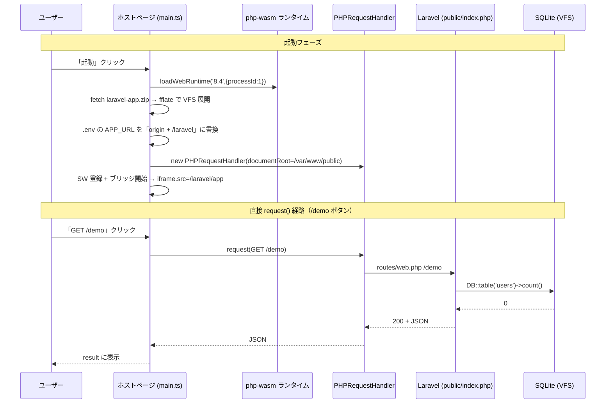
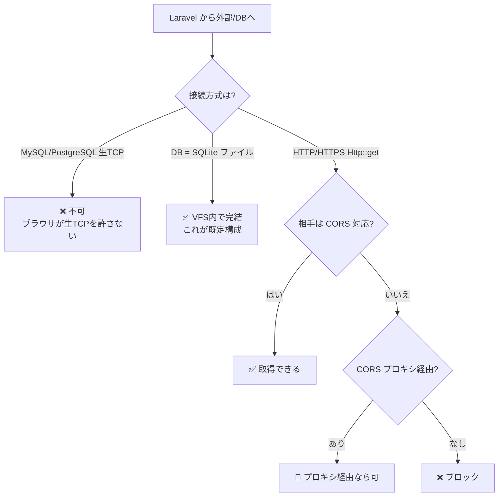
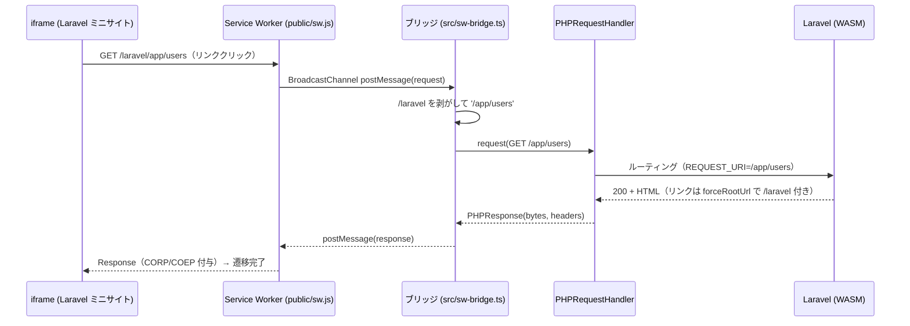

# アーキテクチャ詳細

ブラウザ内だけで Laravel 13 を動かす `php-wasm-laravel-demo` の構成図です。
隣の `nodepod-express-demo`（Node.js + Express 版）と対になる、PHP / Laravel 版です。

---

## 1. nodepod-express-demo との対応

「環境」を NodePod → php-wasm に差し替えただけで、同じ『サーバー不要』の構図が成り立ちます。

```
  WASM ───────▶ php-wasm ────────▶ Laravel ────────▶ あなたのアプリ
 (土台技術)     (PHP 8.4 環境)      (部品/材料)        (routes/web.php 等)
   無料          ← これが「環境」     差し替え可能       自分で書く
   商用OK        WASMで構築          Symfony等でもOK
```

| もの | 役割 | nodepod 版での相当物 |
|------|------|----------------------|
| WASM | 無料の土台技術 | WASM（同じ） |
| **@php-wasm/web** | **WASM で作った PHP 8.4 環境** | NodePod |
| Laravel | その環境で動かす部品 | Express |
| laravel-app/ | 自分のアプリ | server.js |

---

## 2. レイヤー構造（全体像）

```
╔══════════════════════════════════════════════════════════════════╗
║                    あなたの PC / ブラウザ (Chrome)                  ║
║                                                                    ║
║  ┌──────────────────────────────────────────────────────────┐    ║
║  │  ブラウザのタブ (localhost:5173 / COOP+COEP 有効)          │    ║
║  │                                                            │    ║
║  │  ┌────────────────────┐    ┌──────────────────────────┐  │    ║
║  │  │ ホストページ        │    │  @php-wasm/web (WASM PHP) │  │    ║
║  │  │ index.html/main.ts │    │  ┌────────────────────┐  │  │    ║
║  │  │                    │    │  │ public/index.php    │  │  │    ║
║  │  │ [起動ボタン]───────┼───▶│  ├────────────────────┤  │  │    ║
║  │  │ [GET /][GET /demo] │    │  │ Laravel 13 (vendor) │  │  │    ║
║  │  │                    │    │  ├────────────────────┤  │  │    ║
║  │  │ [iframe表示]◀──────┼────│  │ PHP 8.4 ランタイム   │  │  │    ║
║  │  │ [result表示]◀──────┼────│  ├────────────────────┤  │  │    ║
║  │  └────────────────────┘    │  │ SQLite (database/)  │  │  │    ║
║  │      ▲ PHPRequestHandler    │  ├────────────────────┤  │  │    ║
║  │      │  .request()          │  │ WebAssembly (WASM)  │  │  │    ║
║  │      └─────────────────────▶│  └────────────────────┘  │  │    ║
║  │                             └──────────────────────────┘  │    ║
║  └────────────────────────────────────────────────────────────┘  ║
╚════════════════════════════════════════════════════════════════════╝
```

`nodepod` 版は Express が `listen(3000)` してポート経由 + Service Worker で中継していた。
php-wasm 版は **ポートを持たず** `PHPRequestHandler.request()` が Web サーバー相当のルーティングを担う。
iframe 内のページ遷移（リンククリック）は、`nodepod` 版と同じく **Service Worker(`public/sw.js`) が横取り**して
`PHPRequestHandler.request()` へ中継する（詳細は §6）。`/demo` ボタンのように JS から直接 `request()` を呼ぶ経路もある。

---

## 3. 起動フロー（時系列）

```
 ① [起動ボタン] を押す
        │
        ▼
 ② loadWebRuntime('8.4', {processId:1}) → WASM で PHP 8.4 環境が起動
        │
        ▼
 ③ fetch('/laravel-app.zip')（~27MB）→ fflate で展開 → VFS /var/www に書き込み
        │   (8000+ ファイル / 数百ms)
        ▼
 ④ new PHPRequestHandler({ documentRoot:'/var/www/public', ... })
        │
        ▼
 ⑤ .env の APP_URL を「実オリジン + /laravel」へ書換 → URL::forceRootUrl 用
        │
        ▼
 ⑥ Service Worker 登録 + BroadcastChannel ブリッジ開始
        │
        ▼
 ⑦ iframe.src = /laravel/app → SW 経由で Laravel ミニサイトを表示
        │
        ├─▶ iframe 内リンク → SW → ブリッジ(/laravel剥がし) → request() → 遷移
        └─▶ [GET /demo ボタン] → request('/demo') → SQLite → JSON を result に表示
```

---

## 4. 動作シーケンス（Mermaid・直接 request() 経路）

JS から直接 `request()` を呼ぶ経路（`GET /demo` ボタン）。iframe 内リンク遷移は §6 を参照。



---

## 5. ネットワーク制約マップ（nodepod 版と同じ制約）



> nodepod 版の「外部 DB 直結は不可 / CORS 制約」はそのまま当てはまる。
> Laravel 側は `DB_CONNECTION=sqlite` にしておくのが定石（WordPress Playground と同じ発想）。

---

## 6. iframe 内ページ遷移を成立させる Service Worker

`srcdoc` で1ページ貼るだけだとリンク遷移できない。そこで **Service Worker で iframe の
リクエストを横取り**し、メインページで動く PHPRequestHandler へ中継する（WordPress Playground と同方式）。



### 3つの役割分担

| 課題 | 担当 | 解決 |
|------|------|------|
| iframe のリクエスト横取り | `public/sw.js` | scope=`/`、`/laravel/*` のみ中継対象 |
| ルーティング一致 | `src/sw-bridge.ts` | `/laravel` を剥がして `request('/app/...')` |
| リンク生成に `/laravel` 付与 | `AppServiceProvider` | `URL::forceRootUrl(config('app.url'))`（APP_URL は起動時に JS が書換） |
| 単一 PHP への同時実行回避 | `src/sw-bridge.ts` | BroadcastChannel 受信を直列化（mutex 的キュー） |
| COEP 下での iframe 読込 | `public/sw.js` | 応答に `Cross-Origin-Resource-Policy` / `-Embedder-Policy` を付与 |

> なぜ「剥がす」と「付け直す」を分けるか：スコープ付き URL をそのまま渡すと
> `REQUEST_URI=/laravel/app` でも `SCRIPT_NAME=/index.php` となり Laravel が `/laravel/app` を
> 探して 404 になる。ルーティングは素のパスで通し、リンク生成だけ `/laravel` を付けるのが安定。
